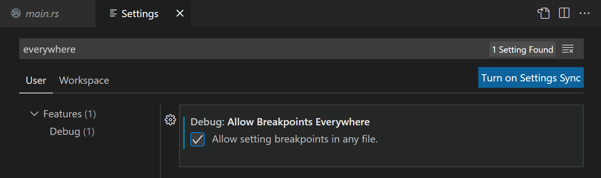

# Rust Debugging in Visual Studio Code

The rust-analyzer extension supports debugging Rust from within VS Code.

## Install debugging support

1.To start debugging, you will first need to install one of two language extension with debugging support:

Microsoft C++ (ms-vscode.cpptools) – on Windows.

CodeLLDB (vadimcn.vscode-lldb) – on macOS/Linux

## Allow Breakpoints

You'll need to enable the setting Debug: Allow Breakpoints Everywhere, which you can find in the Settings editor (Ctrl+,) by searching on 'everywhere`.

## Add brake points
Open `main.rs` and click the left gutter in the editor to set a break point on lines. It should display as a red dot like below.

# Common Problems

## Linker error

if you see linker errors such as "error: linker link.exe not found" when you try to build your Rust program, you may be missing the necessary C/C++ toolset. Depending on your platform, you will need to install a toolset with a C/C++ linker to combine the Rust compiler output.

### Windows

On Windows, you will need to also install Microsoft C++ Build Tools in order to get the C/C++ linker link.exe. Be sure to select the Desktop Development with C++ when running the Visual Studio installer.

Note: You can use the C++ toolset from Visual Studio Build Tools along with Visual Studio Code to compile, build, and verify any codebase as long as you also have a valid Visual Studio license (either Community, Pro, or Enterprise).

### macOS

You may need to install the XCode toolset by running xcode-select --install in a terminal.

### Linux

You may need to install the GCC toolset via the build-essential package by running sudo apt-get install build-essential in a terminal.

## FAQs

### Q: My breakpoints are not being hit. What should I do?

A: Ensure that you have compiled your Rust code with debugging information. Use the `--debug` flag when running `cargo build` or `cargo run`.

### Q: I can't see variable values during debugging. Why?

A: Check that the variables are in scope at the breakpoints. Hover over the variable or use the debug sidebar to inspect their values.

### Q: Debugging is slow. Any tips for improving performance?

A: Avoid setting too many breakpoints. Consider using conditional breakpoints, and utilize features like watch expressions instead of stopping at every line.

Feel free to adjust the content further or let me know if you have specific additions or modifications in mind.
